# 🚀 GPU-Accelerated Entity Resolver

[](https://www.python.org/downloads/)
[](https://developer.nvidia.com/cuda-downloads)
[](LICENSE)
[](https://github.com/astral-sh/ruff)

A high-performance, production-ready Python package for entity resolution and deduplication at scale. Built on NVIDIA RAPIDS (`cudf`, `cuML`, `cupy`), the project keeps the entire pipeline on the GPU to minimize transfers and maximize throughput.

## 📋 Table of Contents

- [Features](#features)
- [Performance](#performance)
- [Requirements](#requirements)
- [Installation](#installation)
- [Quick Start](#quick-start)
- [Advanced Usage](#advanced-usage)
- [Configuration](#configuration)
- [Pipeline Architecture](#pipeline-architecture)
- [API Reference](#api-reference)
- [Troubleshooting](#troubleshooting)
- [Contributing](#contributing)
- [Citation](#citation)
- [License](#license)
- [Acknowledgments](#acknowledgments)

## ✨ Features

### Core Capabilities
- **🏃‍♂️ GPU-Accelerated Pipeline**: End-to-end GPU execution minimizes data transfer bottlenecks
- **🔍 Intelligent Address Processing**: Leverages `libpostal` for robust address parsing and standardization
- **💾 Model Persistence**: Save and load fitted models for production deployment
- **📊 Confidence Scoring**: Multi-factor scoring system for match quality assessment
- **🔄 Incremental Processing**: Transform new data using pre-fitted models

### Multi-Stream Vectorization
Creates rich entity embeddings by combining three complementary approaches:

| Stream       | Method        | Purpose                  | Key Technique                 |
|--------------|---------------|--------------------------|-------------------------------|
| **Syntactic**| TF-IDF        | Character-level patterns | N-gram analysis (3–5 chars)   |
| **Phonetic** | Metaphone     | Sound-based matching     | Phonetic encoding             |
| **Semantic** | Transformers  | Contextual meaning       | `bge-base-en-v1.5` embeddings |

### Advanced Clustering
- **HDBSCAN + SNN Ensemble**: Combines density-based clustering with graph-based rescue mechanism
- **UMAP Manifold Learning**: Ensemble of models with randomized hyperparameters for robust dimensionality reduction
- **Automatic Chain Detection**: Identifies and numbers entities with multiple locations (e.g., “Starbucks – 1”, “Starbucks – 2”)

## ⚡ Performance

- Designed for **hundreds of thousands to millions** of rows on a single GPU.
- Memory scales primarily with TF-IDF vocabulary size and UMAP neighbor graphs.
- **Performance depends on hardware and configuration.** On an NVIDIA A100 40GB, end-to-end runs with the default settings typically process ~200k rows in **tens of minutes to a few hours**. Lighter settings (smaller vocabularies / fewer UMAP epochs) run faster; aggressive settings (larger vocabularies, more ensemble members) improve quality at the cost of runtime and memory.

## 💻 Requirements

### System Requirements
- **GPU**: NVIDIA GPU with Compute Capability 7.0+ (e.g., V100, T4, A100, RTX 2080+, Colab GPUs)
- **CUDA**: Version 11.5+ or 12.x (CUDA 12.x recommended)
- **Memory**:
  - GPU: Minimum 8 GB VRAM (16 GB+ recommended for large datasets)
  - System RAM: ~2× your dataset size

### Software Dependencies

**Core Libraries:**
- Python 3.11+
- pandas, numpy, pydantic, pyyaml

**GPU Libraries (auto-installed with pip method):**
- RAPIDS Suite: `cudf`, `cuml`, `cugraph`, `cupy`, `rmm`

**Specialized Libraries:**
- `sentence-transformers` - Semantic embeddings
- `phonetics` - Phonetic encoding
- `postal` - Address parsing (libpostal)
- `unicodedata2` - Unicode normalization

**Development Tools (optional):**
- `ruff` - Linting and formatting
- `mypy` - Static type checking
- `pytest` - Testing framework

## 📦 Installation

The package supports two installation methods: **pip** (recommended for Colab and simpler setups) or **conda** (recommended for local development).

---

### Method 1: Pip Installation (Recommended for Google Colab)

**For CUDA 12.x (most recent systems):**

```bash
# Clone the repository
git clone https://github.com/andrewjordan3/entity-resolver.git
cd entity-resolver

# Install with GPU dependencies for CUDA 12
pip install -e ".[gpu-cu12]"
```

**For CUDA 11.x (older systems):**

```bash
# Clone the repository
git clone https://github.com/andrewjordan3/entity-resolver.git
cd entity-resolver

# Install with GPU dependencies for CUDA 11
pip install -e ".[gpu-cu11]"
```

**Google Colab Quick Setup:**

```python
# In a Colab notebook cell:
!git clone https://github.com/andrewjordan3/entity-resolver.git
%cd entity-resolver
!pip install -e ".[gpu-cu12]"

# Restart runtime after installation
# Go to: Runtime > Restart runtime
```

---

### Method 2: Conda Installation (Recommended for Local Development)

**Step 1: Create RAPIDS Environment**

```bash
# Create a new environment with RAPIDS
conda create -n entity-resolver -c rapidsai -c conda-forge -c nvidia \
    rapids=24.12 python=3.11 cuda-version=11.8

# Activate the environment
conda activate entity-resolver
```

For more detailed instructions, see the [RAPIDS installation guide](https://rapids.ai/start.html).

**Step 2: Install the Package**

```bash
# Clone the repository
git clone https://github.com/andrewjordan3/entity-resolver.git
cd entity-resolver

# Install the package (CPU dependencies only, RAPIDS already installed)
pip install -e .
```

---

### Verify Installation

```python
import entity_resolver
import cudf

print(f"Entity Resolver version: {entity_resolver.__version__}")
print(f"cuDF version: {cudf.__version__}")
```

## 🚀 Quick Start

```python
import pandas as pd
from entity_resolver import EntityResolver

# Load your data
df = pd.DataFrame({
    'company_name': [
        'Acme Corp', 'ACME Corporation', 'Acme Corp.',
        'TechStart Inc', 'Tech Start LLC'
    ],
    'address': [
        '123 Main St, Chicago IL 60601',
        '123 Main Street, Chicago, IL',
        '123 Main St Chicago IL',
        '456 Oak Ave, Hoffman Estates, IL',
        '456 Oak Avenue Hoffman Estates IL'
    ]
})

# Initialize the resolver.
# This uses the default settings. For custom settings, provide a path
# to your YAML file, e.g., EntityResolver(config_path='my_config.yaml')
resolver = EntityResolver()

# Fit and transform in one step
resolved_df = resolver.fit_transform(df)

# Examine results
print(resolved_df[['company_name', 'canonical_name', 'confidence_score']])

# Generate a detailed report
report = resolver.generate_report(df)
print(f"Reduced {report['summary']['unique_entities_before']} entities "
      f"to {report['summary']['unique_entities_after']}")

# Get records flagged for review
review_df = resolved_df[resolved_df['needs_review']]
print(f"Records needing review: {len(review_df)}")
```

## 🔧 Advanced Usage

### Saving and Loading Models

```python
# Train and save
resolver = EntityResolver(config)
resolver.fit(training_df)
resolver.save_model('models/my_resolver')

# Load and use
resolver = EntityResolver.load_model('models/my_resolver')
new_resolved_df = resolver.transform(new_df)
```

### Custom Configuration

To customize the pipeline, create a `config.yaml` file and pass its path to the resolver. You only need to specify the parameters you want to override.

**Example `my_config.yaml`:**
```yaml
# my_config.yaml
output:
  review_confidence_threshold: 0.80
  split_address_components: true

clusterer:
  hdbscan_params:
    min_cluster_size: 2
  umap_params:
    n_neighbors: 30

validation:
  name_fuzz_ratio: 85
```

**Usage in Python:
```python
from entity_resolver import EntityResolver

# Load the resolver with your custom configuration
resolver = EntityResolver(config_path='my_config.yaml')
```

### Processing Large Datasets

```python
# For datasets larger than GPU memory, process in chunks
chunk_size = 100_000
chunks = []

for i in range(0, len(large_df), chunk_size):
    chunk = large_df.iloc[i:i+chunk_size]
    resolved_chunk = resolver.transform(chunk)
    chunks.append(resolved_chunk)

final_df = pd.concat(chunks, ignore_index=True)
```
**Note**: The fit() or fit_transform() methods must be trained on a dataset that can fit into GPU memory, as they build global models (e.g., vectorizer vocabularies). Once the resolver is fitted, the transform() method can be used to process new, unseen data in chunks.

## ⚙️ Configuration

The `ResolverConfig` object controls all aspects of the pipeline:

| Component       | Key Parameters                      | Description                         |
|----------------|-------------------------------------|-------------------------------------|
| `columns`      | `entity_col`, `address_cols`        | Input column mapping                |
| `normalization`| `replacements`, `suffixes_to_remove`| Text cleaning rules                 |
| `vectorizer`   | `encoders`, `stream_proportions`    | Feature extraction settings         |
| `clusterer`    | `umap_params`, `hdbscan_params`     | Clustering hyperparameters          |
| `validation`   | `name_fuzz_ratio`, `address_fuzz_ratio` | Match validation thresholds     |
| `output`       | `review_confidence_threshold`       | Output formatting options           |

## 🏗️ Pipeline Architecture

```mermaid
graph TB
    Input[📄 Input DataFrame<br/>company_name, address] --> Normalizer

    subgraph Preprocessing["🔧 PREPROCESSING"]
        Normalizer[Text Normalizer<br/>• Remove suffixes<br/>• Replace patterns<br/>• Unicode normalization]
        AddressProc[Address Processor<br/>• libpostal parsing<br/>• Component extraction<br/>• Name consolidation]
        Normalizer --> AddressProc
    end

    subgraph Vectorization["🧬 VECTORIZATION"]
        AddressProc --> TfidfStream[Syntactic Stream<br/>TF-IDF n-grams]
        AddressProc --> PhoneticStream[Phonetic Stream<br/>Metaphone encoding]
        AddressProc --> SemanticStream[Semantic Stream<br/>MiniLM embeddings]

        TfidfStream --> ContextVec[Context Vectorizer<br/>• Energy balancing<br/>• Stream concatenation<br/>• SVD reduction]
        PhoneticStream --> ContextVec
        SemanticStream --> ContextVec
    end

    subgraph Clustering["🔍 CLUSTERING"]
        ContextVec --> UMAP[UMAP Ensemble<br/>• Randomized params<br/>• Manifold learning]
        UMAP --> HDBSCAN[HDBSCAN<br/>Density clustering]
        HDBSCAN --> SNN[SNN Graph Rescue<br/>• Noise recovery<br/>• Consensus voting]
    end

    subgraph Refinement["✨ REFINEMENT"]
        SNN --> Validator[Cluster Validator<br/>• Fuzzy matching<br/>• Address verification]
        Validator --> Merger[Cluster Merger<br/>• Similar clusters<br/>• High-confidence joins]
        Merger --> Refiner[Cluster Refiner<br/>• Canonical selection<br/>• Chain numbering]
    end

    subgraph Output["📊 OUTPUT"]
        Refiner --> Scorer[Confidence Scorer<br/>• Multi-factor scoring<br/>• Review flagging]
        Scorer --> Reporter[Reporter<br/>• Statistics<br/>• Quality metrics]
        Reporter --> Result[📋 Resolved DataFrame<br/>canonical_name, confidence, chain_num]
    end

    style Input fill:#4A90E2,stroke:#2E5C8A,stroke-width:3px,color:#fff
    style Result fill:#50C878,stroke:#2D7A4A,stroke-width:3px,color:#fff
    style Preprocessing fill:#FFB74D,stroke:#E68900,stroke-width:2px,color:#333
    style Vectorization fill:#BA68C8,stroke:#7B1FA2,stroke-width:2px,color:#fff
    style Clustering fill:#4DB6AC,stroke:#00695C,stroke-width:2px,color:#fff
    style Refinement fill:#F06292,stroke:#C2185B,stroke-width:2px,color:#fff
    style Output fill:#64B5F6,stroke:#1976D2,stroke-width:2px,color:#fff
```



### Pipeline Stages

**Preprocessing (Steps 1–2)**
- Text normalization and standardization
- Address parsing with libpostal
- Name consolidation for shared addresses

**Vectorization (Step 3)**
- TF-IDF character n-grams
- Phonetic encoding
- Semantic embeddings
- Energy balancing across streams

**Clustering (Steps 4–5)**
- UMAP ensemble for dimensionality reduction
- HDBSCAN for core clustering
- SNN graph for noise rescue
- Cluster validation and merging

**Finalization (Steps 6–7)**
- Canonical entity selection
- Chain entity numbering
- Confidence scoring
- Review flagging

## 📚 API Reference

### Main Classes
- `EntityResolver`: Main orchestrator class
- `ResolverConfig`: Configuration management
- Component classes: `TextNormalizer`, `AddressProcessor`, `MultiStreamVectorizer`, `EntityClusterer`, `ClusterValidator`, `ClusterMerger`, `ClusterRefiner`, `ConfidenceScorer`

### Key Methods

```python
# EntityResolver methods
resolver.fit(df)                 # Train on data
resolver.transform(df)           # Apply to new data
resolver.fit_transform(df)       # Train and transform
resolver.save_model(path)        # Save fitted model
resolver.load_model(path)        # Load saved model
resolver.get_review_dataframe()  # Get review summary
resolver.generate_report(df)     # Generate statistics
```

## 🐛 Troubleshooting

### Common Issues

**CUDA Out of Memory**
```python
# Reduce batch sizes
config.vectorizer.semantic_batch_size = 256
config.clusterer.cosine_consensus_batch_size = 1024
```

**Import Errors**
```bash
# Verify RAPIDS installation
python -c "import cudf; print(cudf.__version__)"
```

**Poor Clustering Results**
```python
# Adjust sensitivity
config.clusterer.hdbscan_params['min_cluster_size'] = 2
config.validation.name_fuzz_ratio = 80
```

## 🤝 Contributing

Contributions are welcome!

```bash
# Development setup
git clone https://github.com/andrewjordan3/entity-resolver.git
cd entity-resolver

# Install with GPU and development dependencies
pip install -e ".[gpu-cu12,dev]"

# Run linting and formatting
ruff check .
ruff format .

# Run type checking
mypy .

# Run tests (when available)
pytest tests/
```

## 📝 Citation

If you use this package in your research, please cite:

```bibtex
@software{entity_resolver,
  author = {Andrew Jordan},
  title = {GPU-Accelerated Entity Resolver},
  year = {2025},
  url = {https://github.com/andrewjordan3/entity-resolver}
}
```

## 📄 License

This project is licensed under the MIT License — see the [LICENSE](LICENSE) file for details.

## 🙏 Acknowledgments

- NVIDIA RAPIDS team for the GPU acceleration framework
- OpenCage for libpostal address parsing
- Hugging Face for sentence-transformers

Maintained by: **Andrew Jordan**
Contact: **andrewjordan3@gmail.com**
Last Updated: **November 2025**

